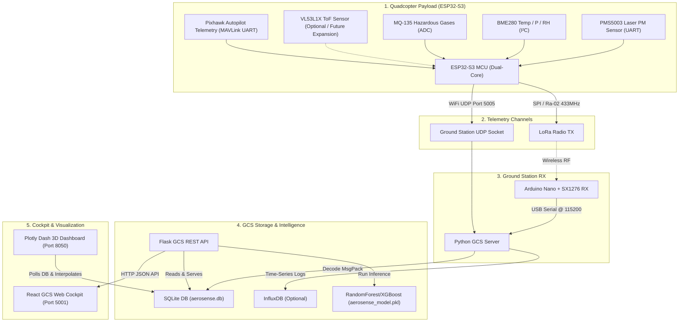

# 🛸 AeroSense — Presentation Brief & Reproducible Demo Guide

This document is a comprehensive guide designed for teammates and presentation developers to understand the **AeroSense Quadcopter 3D Spatial Pollution Mapping System**, build a PowerPoint slide deck, and successfully demonstrate the working project live.

---

## 📐 System Architecture

The diagram below shows how environmental sensors, payload processor, wireless telemetry, ground database, and the visualization engines interact.



---

## 📽️ PowerPoint Slide Deck Outline

Use the templates below to construct your slide deck. Each slide is designed with visual concepts, slide content, and presenter notes to ensure the presentation sounds authoritative and technical.

````carousel
### Slide 1: Title & Project Vision
**Visual Concept**: A sleek dark slide with a minimal glowing drone outline and the title in neon orange.

*   **Slide Title**: AeroSense: 3D Spatial Environmental Mapping
*   **Sub-title**: Dual-Core ESP32-S3 IoT Quadcopter Payload & Real-time GCS
*   **Key Points**:
    *   **Low Cost**: Built under ₹2,600 (a 55% saving compared to SBC builds).
    *   **3D Volumetric Mapping**: Captures latitude, longitude, and altitude to map vertical pollution profiles.
    *   **Predictive AI**: Forecasts future ground-level PM2.5 concentrations using atmospheric boundary gradients.

**Presenter Talking Points**:
> *"Good morning/afternoon. Today, we present AeroSense, an integrated hardware and software stack designed to mount onto quadcopters to map atmospheric pollution in 3D coordinate space. Conventional air monitoring stations are fixed to the ground and fail to capture vertical distributions. AeroSense solves this by recording gas levels, particulate matter, and meteorological gradients dynamically, broadcasting them via LoRa, and building real-time 3D spatial models."*
<!-- slide -->
### Slide 2: The Core Problem
**Visual Concept**: A vertical diagram representing an atmospheric inversion layer (warm air trapping cold, dirty air underneath) and how fixed ground stations miss the upper boundaries.

*   **Slide Title**: Why Vertical Profiles Matter
*   **Key Points**:
    *   **Ground Stations are Blind**: Fixed ground-level sensors only record local surface air quality.
    *   **Temperature Inversions**: Warm air layers aloft trap particulate matter (PM2.5) at specific altitude bands.
    *   **Hyperlocal Dynamics**: Pollution spreads unevenly across altitudes due to pressure, wind, and thermal layers.
    *   **The AeroSense Solution**: Vertical column profiling to identify inversion boundaries.

**Presenter Talking Points**:
> *"Most air quality data comes from stationary ground monitors. However, urban pollution is a 3D problem. Temperature inversions occur when warm air layers trap particulate matter close to the ground or at specific altitudes. By flying a quadcopter vertically and horizontally through waypoint grids, AeroSense builds a complete volumetric profile of these layers, allowing scientists to pinpoint where pollution is trapped."*
<!-- slide -->
### Slide 3: Hardware Architecture
**Visual Concept**: A table detailing the component selections, interfaces, and costs.

*   **Slide Title**: Low-Weight, Low-Cost Payload Design
*   **Key Points**:
    *   **Microcontroller**: Dual-core ESP32-S3 running asynchronous routines.
    *   **Sensors**: BME280 (Temp/Humidity/Pressure) & PMS5003 (Laser PM2.5/PM10 particulate counter).
    *   **Telemetry**: Ra-02 LoRa module (433MHz) using optimized MessagePack packing to maximize range and minimize airtime.
    *   **Obstacle Avoidance (Future Upgrade)**: Pre-engineered software support for VL53L1X Time-of-Flight (ToF) laser rangefinder.
    *   **Telemetry Routing**: Pixhawk autopilot GPS values are routed directly to the ESP32-S3 via MAVLink, avoiding redundant sensors.

**Presenter Talking Points**:
> *"Our hardware selection prioritizes weight reduction and cost efficiency. We ported the design to an ESP32-S3. By querying GPS data directly from the drone's Pixhawk flight controller via MAVLink, we eliminated the need for a separate GPS module. The total bill of materials is under ₹2,600, which is significantly cheaper than a Raspberry Pi based payload."*
<!-- slide -->
### Slide 4: Embedded Firmware Optimization
**Visual Concept**: A block diagram showing how 13 raw values are packed into a compact binary MessagePack byte-array and sent over LoRa.

*   **Slide Title**: Asynchronous Logging & Optimized Serialization
*   **Key Points**:
    *   **Dual-Firmware Options**:
        *   *MicroPython*: Asynchronous event loop (`asyncio`) for rapid testing.
        *   *Arduino C++*: High-frequency loop optimized for production.
    *   **Data Compression**: Custom MessagePack float serialization (`0xCA` markers) reduces raw text characters to a compact 65-byte payload.
    *   **Real-Time Telemetry Transmission**: High-frequency streaming of MessagePack telemetry over LoRa or WiFi UDP channels directly to the GCS database.

**Presenter Talking Points**:
> *"To ensure telemetry runs over low-bandwidth LoRa channels, we optimized our communication. Instead of transmitting heavy JSON strings, we pack the 13 telemetry fields—ranging from GPS position to PM concentrations—into binary MessagePack structures. This yields a fixed-size 65-byte packet. This compression increases LoRa range and significantly improves battery life on the drone."*
<!-- slide -->
### Slide 5: Ground Control Station (GCS)
**Visual Concept**: A screenshot or schematic showing the flow of data into the SQLite database and the Flask API.

*   **Slide Title**: Multi-Threaded GCS Telemetry Server
*   **Key Points**:
    *   **Concurrent Receivers**: Dual listeners run in separate threads to handle USB serial telemetry (from the LoRa ground receiver) and WiFi UDP sockets.
    *   **Data Persistence**: SQLite database holds the unified flight records.
    *   **InfluxDB Integration**: Optional time-series push for telemetry analysis.
    *   **Flask REST API**: Exposes JSON endpoints for telemetry history, system config, mission generation, and AI prediction.

**Presenter Talking Points**:
> *"Once the telemetry is sent, the Ground Control Station receives it. The GCS is a multi-threaded Python server that listens for UDP network packets or LoRa serial bytes. The unpacked variables are immediately written to a local SQLite database and broadcasted. A Flask REST API acts as the data hub, feeding both the 3D Dashboards and the React control console."*
<!-- slide -->
### Slide 6: Plotly Dash 3D Dashboard
**Visual Concept**: A schematic showing a 3D scatter plot of a drone's flight path colored by AQI scale.

*   **Slide Title**: Live 3D Spatial Visualizations
*   **Key Points**:
    *   **3D Scatter Plots**: Renders the complete flight path in 3D coordinate space using latitude, longitude, and altitude.
    *   **AQI Color Scales**: Visually represents pollution severity using color gradients (green to purple).
    *   **2D Slice Heatmaps**: Uses spatial cubic interpolation (via `scipy.interpolate.griddata`) to approximate particulate density at specific altitude layers (e.g., 15m, 30m, 50m).
    *   **Live Ticker & Console**: Streams live logs and alert tickers directly to the user.

**Presenter Talking Points**:
> *"The Plotly Dash dashboard provides real-time 3D telemetry. It maps the flight path, color-coded by pollution levels. It also uses Scipy's spatial cubic interpolation to build 2D horizontal slices at target altitudes. This shows users where pollution hot spots exist, even in areas the drone didn't fly through directly."*
<!-- slide -->
### Slide 7: AI/ML Vertical Inversion Forecasting
**Visual Concept**: A flowchart showing vertical profile columns (Temp, Pressure, PM2.5 gradients at 15m, 30m, 50m) feeding into a RandomForest model to output ground-level PM2.5 predictions.

*   **Slide Title**: Atmospheric Boundary Inversion Forecasting
*   **Key Points**:
    *   **Diurnal Boundary Mechanics**: Inversions trap pollution aloft during cold mornings. As the sun heats the ground, the inversion breaks and mixes the pollution downward.
    *   **The AI Predictor**: A Random Forest / XGBoost model trained on vertical columns (15m, 30m, 50m).
    *   **Gradient Features**: Computes differences in temperature ($\Delta T = T_{50} - T_{15}$) and pressure as proxy features.
    *   **Forecasting Horizon**: Predicts ground-level PM2.5 concentrations 15 to 30 minutes in advance.

**Presenter Talking Points**:
> *"Our project includes a machine learning model that forecasts future air quality. During inversions, pollution is trapped aloft. When the sun rises, the atmosphere mixes, bringing that pollution back to the ground. Our Random Forest model analyzes temperature and pressure gradients across altitude layers to predict future ground-level PM2.5 spikes before they occur."*
<!-- slide -->
### Slide 8: Safety & Autonomous Mission Planning
**Visual Concept**: A side-by-side view showing the Leaflet grid planner and the circular obstacle radar interface.

*   **Slide Title**: Autonomy, Obstacle Radar & Mission Generation
*   **Key Points**:
    *   **Waypoint Grid Generator**: Generates ArduPilot-compliant waypoint surveys using an origin point, grid size, and lane spacing.
    *   **Obstacle Radar (Simulated)**: A radar interface pre-configured to display proximity warnings using simulated distance data (ready for future VL53L1X sensor integration).
    *   **Config Manager**: Direct reading/writing of the payload configuration files on the ESP32-S3 over the network.

**Presenter Talking Points**:
> *"Safety and flight planning are integrated into the React Ground Control Station. The interface includes an automated mission generator that exports waypoint files directly into ArduPilot. For flight safety, the ground control station features an obstacle radar panel designed to show proximity warnings, which is currently simulated and ready for plug-and-play rangefinder hardware integration."*
````

---

## 🏃 Super-Reproducible 3-Minute Live Demo Guide

To demonstrate the project in a live presentation, follow these steps to run the simulation and display the interactive dashboards.

### Prerequisites

Open a terminal and install the required Python libraries:
```bash
pip install flask flask-cors pandas numpy scipy msgpack dash plotly scikit-learn
```

---

### Step-by-Step Launch Execution

#### 1. Start the GCS GCS API & Dash Server
Double-click [run_aerosense.bat](file:///c:/Users/aroma/Desktop/drone/AeroSense_Project/run_aerosense.bat) in the project directory, or execute the launcher script in your terminal:
```powershell
python project/launcher.py
```
*   **What this does**:
    1. Frees ports `5001` (GCS API) and `8050` (Dash Dashboard).
    2. Launches the Flask GCS API Server (`aerosense_api.py`).
    3. Launches the Plotly Dash Server (`aerosense_dashboard.py`).
    4. Automatically opens two browser tabs:
        *   React Ground Control Station Cockpit: [http://localhost:5001](http://localhost:5001)
        *   3D Volumetric Mapping Dashboard: [http://localhost:8050](http://localhost:8050)

#### 2. Start the Live Telemetry Ground Receiver & Database Writer
Open a second terminal and run the ground station receiver script:
```powershell
python project/Ground/ground_station/aerosense_ground.py
```
*   **What this does**: Initializes the SQLite database (`project/data/aerosense.db`) and listens on WiFi UDP Port `5005` for incoming telemetry packets.

#### 3. Start the Live Flight Simulator
Open a third terminal and run the simulator script to broadcast packets:
```powershell
python project/Ground/ground_station/simulate_flight.py
```
*   **What this does**: Simulates a quadcopter flying along the waypoint mission. It generates telemetry packets (representing an early-morning temperature inversion) and broadcasts them over UDP port `5005`.

---

### 🖥️ Demo Walkthrough (What to show the audience)

To present the system, demonstrate the following interfaces in your browser:

| Step | Platform / URL | Action / What to Show |
| :--- | :--- | :--- |
| **1** | **GCS Cockpit**<br>[http://localhost:5001](http://localhost:5001) | **Real-time Console**: Show the live scrolling console output. Note how telemetry variables update dynamically as the simulated drone flies. |
| **2** | **GCS Cockpit**<br>[http://localhost:5001](http://localhost:5001) | **Obstacle Radar**: Click on the **Radar** page to display the dynamic circular indicator. Explain how the ToF sensor detects proximity alerts. |
| **3** | **3D Dashboard**<br>[http://localhost:8050](http://localhost:8050) | **3D Volumetric Map**: Navigate to the **3D Volumetric Mapping** page. Rotate and zoom the 3D scatter plot of the drone's flight path. Explain that colors map to particulate concentrations. |
| **4** | **3D Dashboard**<br>[http://localhost:8050](http://localhost:8050) | **2D Elevation Slices**: Click on the **2D Spatial Slices** page. Drag the elevation slider (e.g., to 15m, 30m, 50m) to show the interpolated heatmaps of PM2.5 density. |
| **5** | **GCS Cockpit**<br>[http://localhost:5001/#/predictor](http://localhost:5001/#/predictor) | **AI Forecast**: Explain how the Random Forest model analyzes temperature/pressure gradients across altitudes to predict ground-level PM2.5 levels. |
