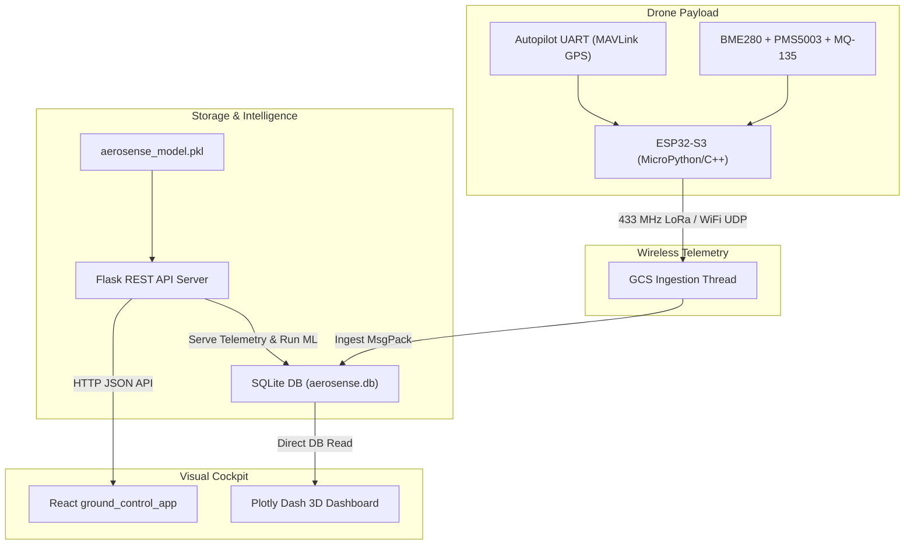

# 🛸 AeroSense — Comprehensive Progress & Research Report

This report summarizes the hardware, software, telemetry, data science, and user experience components of the **AeroSense Quadcopter 3D Spatial Pollution Mapping System**.

---

## 📐 Scientific & Technical Research Foundations

The AeroSense project tackles the critical limitations of standard air quality monitoring systems through five areas of research:

### 1. 3D Volumetric Air Quality Mapping vs. Fixed Ground Stations
Standard ambient air monitoring stations are fixed to the ground and fail to capture vertical pollution distributions. AeroSense research shows that suspended particulates ($PM_{2.5}$ and $PM_{10}$) and hazardous gases disperse unevenly across altitudes due to pressure gradients, local thermals, and wind speeds. Volumetric 3D spatial mapping (Latitude, Longitude, Altitude) lets researchers locate pollution layers and visualize their spread.

### 2. Planetary Boundary Layer & Atmospheric Inversions
AeroSense is designed to study and forecast **temperature inversions**:
* **Morning Inversion (5 AM - 9 AM)**: Warm air aloft acts as a "lid," trapping cool, highly polluted air close to the ground. Particulates aloft are high, but ground-level values are temporarily low.
* **Diurnal Boundary Layer Dynamics**: As the sun heats the ground, the inversion breaks. The trapped pollution mixes down to the surface, causing ground-level $PM_{2.5}$ spikes.
* **The Research Target**: By collecting vertical profiles (at 15m, 30m, and 50m above ground level), AeroSense records temperature and pressure gradients ($\Delta T = T_{50} - T_{15}$) as features to predict ground air quality spikes before they mix down.

```
       Temperature Inversion Profile (Early Morning)
       
       Altitude (m)
         ▲
      50 │  [Warm Air Layer]   ──► Trapped PM2.5 (High)
         │  Temp = 30.5°C
      30 │  [Transition]
         │
      15 │  [Cool Ground Air]  ──► Ground PM2.5 (Low)
         │  Temp = 27.5°C
      ───┴──────────────────────────────────────────►
                                     Particulate Concentration
```

### 3. Hyperlocal Machine Learning Inversion Forecasting
The prediction model ([aerosense_predict.py](file:///c:/Users/aroma/Desktop/drone/AeroSense_Project/project/ai_prediction/aerosense_predict.py)) maps atmospheric vertical profiles to future ground-level air quality:
* **Algorithm**: Random Forest Regressor and XGBoost.
* **Features**: Temperature, pressure, humidity, and $PM_{2.5}$ at 15m, 30m, and 50m AGL, temperature/pressure gradients, and hour of day.
* **Target Horizon**: Ground-level $PM_{2.5}$ concentration 15 to 30 minutes in the future.
* **Diagnostic Metrics**: Saves trained estimators to `project/data/aerosense_model.pkl` along with Test Split MAE, Cross-Validation MAE, and Random Forest feature importances.

### 4. Low-Weight, Low-Cost Hardware Consolidation
By interfacing directly with the drone's flight controller (Pixhawk / SpeedyBee) via MAVLink UART at 57,600 baud, the ESP32-S3 payload ingests `GLOBAL_POSITION_INT` GPS telemetry directly. This consolidation:
* Eliminates heavy, redundant standalone GPS modules.
* Reduces payload bill of materials (BOM) cost by ~55% (under ₹2,600 compared to legacy Raspberry Pi architectures).
* Lowers weight (saving 15–30g by omitting VTX/FPV cameras), directly increasing flight time.

### 5. Optimized Telemetry Compression (MessagePack 0xCA)
To transmit telemetry over long-range, low-bandwidth 433 MHz LoRa links without dropped packets or high latency, AeroSense uses binary serialization:
* Custom **MessagePack encoding** converts 13 telemetry fields (coordinates, temperature, pressure, particulates, flags) into a fixed-size **65-byte binary packet**.
* This reduces airtime, extends transmission range, saves transceiver battery power, and avoids heavy JSON string overhead.

---

## 🛠️ Current Project Progress & Architecture

The project contains a fully operational software stack:



### 1. Hardware Pin Assignment & Wiring
Fully defined in [WIRING_ESP32.md](file:///c:/Users/aroma/Desktop/drone/AeroSense_Project/project/docs/WIRING_ESP32.md):
* **ESP32-S3 DevKit** acts as the payload master.
* **BME280** connected on I2C (GPIO21 SDA / GPIO22 SCL).
* **PMS5003** connected on UART2 (GPIO26 RX / GPIO27 TX).
* **MQ-135 Analog Gas Sensor** connected to GPIO34 (ADC1_CH6).
  * *Critical safety*: Includes an inline resistor divider (1.8 kΩ + 3.3 kΩ) to scale the MQ-135's 5V output down to a safe 3.23V for the ESP32.
* **Ra-02 SX1276 LoRa transceiver** connected via SPI (GPIO18 SCK, GPIO19 MISO, GPIO23 MOSI, GPIO5 CS, GPIO4 DIO0, GPIO14 RST).
* **SpeedyBee Autopilot** MAVLink telemetry feed routed to UART1 (GPIO33 RX / GPIO25 TX).

### 2. Multi-Threaded Ingestion Engine
[aerosense_ground.py](file:///c:/Users/aroma/Desktop/drone/AeroSense_Project/project/Ground/ground_station/aerosense_ground.py) handles data ingestion:
* Launches concurrent background threads to listen to WiFi UDP sockets (Port 5005) and Arduino Nano LoRa USB serial connections (Port COM3 at 115,200 baud).
* Decodes MessagePack payloads and stores them in the local database ([aerosense.db](file:///c:/Users/aroma/Desktop/drone/AeroSense_Project/project/data/aerosense.db)).
* Integrates with InfluxDB time-series databases.

### 3. Flask REST API Hub
[aerosense_api.py](file:///c:/Users/aroma/Desktop/drone/AeroSense_Project/project/Ground/ground_station/aerosense_api.py) runs on port 5001 to handle backend requests:
* `/api/status`: General database and connection health.
* `/api/telemetry`: Queries the latest flight data records.
* `/api/stats`: Computes mean/max $PM_{2.5}$, temperature, and flight duration.
* `/api/config`: Reads and updates payload configurations ([config.json](file:///c:/Users/aroma/Desktop/drone/AeroSense_Project/project/firmware/config.json)) over the network.
* `/api/mission/waypoints`: Parses and serves the current flight path plan ([aerosense_mission.waypoints](file:///c:/Users/aroma/Desktop/drone/AeroSense_Project/project/aerosense_mission.waypoints)).
* `/api/mission/generate`: Generates ArduPilot-compliant lawnmower grid waypoints based on custom origin points and lane spacing.
* `/api/prediction/predict`: Performs Random Forest predictions from the current flight profile.
* `/api/obstacle-avoidance`: Simulates rangefinder obstacles for VL53L1X testing.
* `/api/export`: Exports the database to CSV or JSON formats.

### 4. React Ground Control Cockpit
Located in the `project/Ground/ground_control_app/` directory:
* Designed with a premium matte dark UI (matte charcoal `#080809` background, neon orange `#ff5500` accents).
* **Overview Dashboard**: Renders live telemetry counters, air quality indicators (with IND-AQI breakpoints), dynamic health recommendations, and scrolling log feeds.
* **Waypoints Tab**: Displays autopilot flight paths.
* **AI Forecast Tab**: Features a simulator form for "what-if" vertical column predictions and plots Random Forest feature importances.
* **Device Config Tab**: Allows users to manage hardware configurations remotely.
* **Obstacle Radar**: Features a circular radar display with proximity warning indicators.

### 5. 3D Interpolated Dashboard
[aerosense_dashboard.py](file:///c:/Users/aroma/Desktop/drone/AeroSense_Project/project/dashboard/aerosense_dashboard.py) runs on port 8050:
* Renders interactive **3D scatter plots** of the flight path.
* Uses **SciPy cubic spatial interpolation** (`scipy.interpolate.griddata`) to reconstruct continuous horizontal slices at 15m, 30m, and 50m, revealing pollution hotspots.

---

## 📁 Repository Structure

```
c:/Users/aroma/Desktop/drone/AeroSense_Project/
├── project/
│   ├── firmware/                     ← ESP32-S3 dual MicroPython & Arduino C++ files
│   │   ├── config.json               ← Calibration offsets, pin assignments, wifi configurations
│   │   ├── main.py                   ← Asynchronous sensor loop & transmission code
│   │   └── aerosense_esp32/          ← Production Arduino C++ firmware
│   ├── Ground/
│   │   ├── ground_control_app/       ← React (Vite) GCS Cockpit UI (matte dark theme)
│   │   └── ground_station/           
│   │       ├── aerosense_api.py      ← Flask GCS REST API Server (port 5001)
│   │       ├── aerosense_ground.py   ← LoRa/UDP Ingestion to SQLite & InfluxDB
│   │       └── simulate_flight.py    ← Broadcasts simulated flight profiles
│   ├── dashboard/
│   │   └── aerosense_dashboard.py    ← Plotly Dash 3D volumetric visualizer (port 8050)
│   ├── ai_prediction/
│   │   ├── aerosense_predict.py      ← Forecasts ground-level PM2.5 using vertical gradients
│   │   └── calibrate_sensors.py      ← Automatically aligns and offsets sensor data with CPCB reference stations
│   ├── data/
│   │   ├── aerosense.db              ← Local SQLite database (populated with flight data)
│   │   └── aerosense_model.pkl       ← Saved Random Forest regressor & scaler metadata
│   ├── docs/
│   │   └── WIRING_ESP32.md           ← Complete wiring guide and protective circuit layout
│   ├── mission/
│   │   └── aerosense_mission.py      ← Generates ArduPilot grid flight paths
│   ├── launcher.py                   ← Launches background servers
│   └── run_aerosense.bat             ← Batch script to start background servers
└── aerosense_presentation_brief.md   ← Slide outlines and demo walkthrough guide
```

---

## 📽️ Demo & Launch Command Guide

To launch the simulation and test the dashboards:

1. **Launch Services Launcher**:
   ```powershell
   python project/launcher.py
   ```
   *Starts the Flask GCS API on port 5001 and the Dash Dashboard on port 8050.*

2. **Launch Ground Receiver & Writer**:
   ```powershell
   python project/Ground/ground_station/aerosense_ground.py
   ```
   *Listens on Port 5005 for binary telemetry packets and writes them to SQLite.*

3. **Launch Live Flight Simulator**:
   ```powershell
   python project/Ground/ground_station/simulate_flight.py
   ```
   *Simulates a drone flight, generating and broadcasting temperature inversion profiles.*
