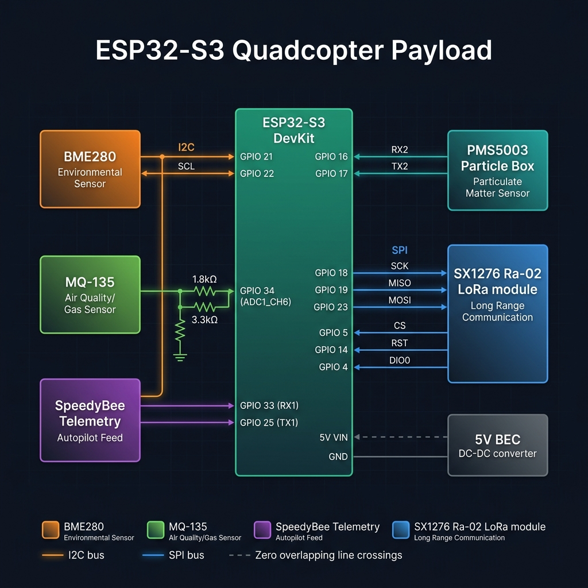

# AeroSense — ESP32-S3 Pin Assignment & Wiring Reference

This document defines the hardware connections for the AeroSense sensor payload. Redundant modules (standalone GPS, MicroSD loggers, VL53L1X, and HC-SR04 rangefinders) have been removed, and GPS location metrics are now ingested directly from the Pixhawk autopilot via telemetry.



---

## ESP32-S3 Complete Pin Mapping

| Component | Sensor Pin | ESP32-S3 GPIO | Wire Color / Protocol Group | Technical Purpose |
| :--- | :--- | :--- | :--- | :--- |
| **Main Power IN** | VCC (5V) / GND | **5V VIN** / **GND** | Dashed Black/White (Power Rail) | Direct 5V step-down feed from your external 5V BEC buck converter module. |
| **BME280** (Climate Module) | VCC / GND / SCL / SDA | **3.3V** / **GND** / **GPIO22** / **GPIO21** | Orange (I2C Bus) | Reads ambient relative temperature, humidity metrics, and raw barometric pressure. |
| **PMS5003** (Laser Particle Box) | VCC (5V) / GND / TXD / RXD | **5V BEC Rail** / **GND Rail** / **GPIO16 (RX2)** / **GPIO17 (TX2)** | Teal (Hardware UART2) | Laser diagnostic tracking for suspended particulate matter (PM2.5 and PM10). |
| **MQ-135** (Gas Sensor) | VCC (5V) / GND / AO (Analog Out) | **5V BEC Rail** / **GND Rail** / **GPIO34 (ADC1_CH6)** | Vibrant Green (Analog ADC) | Tracks volatile gases. **Must route inline through a 1.8 kΩ + 3.3 kΩ resistor divider** to drop 5V output to a safe 3.23V. |
| **SX1276 Ra-02** (LoRa) | VCC / GND / SCK / MISO / MOSI / NSS (CS) / DIO0 / RST | **3.3V** / **GND** / **GPIO18** / **GPIO19** / **GPIO23** / **GPIO5** / **GPIO4** / **GPIO14** | Royal Blue (Hardware SPI) | Forms your 433 MHz wireless telemetry pipeline to transmit raw MessagePack frames down to the ground station. |
| **SpeedyBee Telemetry** (Autopilot Feed) | TX / RX / GND | **GPIO33 (RX1)** / **GPIO25 (TX1)** / **GND** | Purple (Hardware UART1) | Direct serial link to autopilot (MAVLink protocol at 57600 baud) to ingest real-time `GLOBAL_POSITION_INT` GPS coordinates. |

---

## Shared Bus Architecture

### I2C Bus
- **SDA (GPIO21)** and **SCL (GPIO22)**
- Shared by BME280 (default I2C address: `0x76` or `118` decimal).
- Add two **4.7 kΩ** pull-up resistors from SDA and SCL to **3.3V**.

### SPI Bus
- **MOSI (GPIO23)**, **MISO (GPIO19)**, and **SCK (GPIO18)**
- Used by LoRa SX1276 module (CS = **GPIO5**).

---

## ⚠️ Electrical Protection & Level Shifting

> [!CAUTION]
> **MQ-135 Resistor Divider Requirement**
> The MQ-135 sensor outputs an analog voltage up to **5.0V** under high gas concentrations. The ESP32-S3 analog pins are only rated for **3.3V** max. You **MUST** wire a simple resistor divider between the MQ-135 AO pin and ESP32-S3 GPIO34:
> 
> ```
> MQ-135 AO -----> [ 1.8 kΩ Resistor ] -----> ESP32 GPIO34 (ADC1_CH6)
>                                        |
>                                  [ 3.3 kΩ Resistor ]
>                                        |
>                                       GND
> ```
> This steps down the 5.0V max analog output voltage to `5.0 * (3.3 / (1.8 + 3.3)) = 3.23V`, protecting the ESP32 internal ADC.
