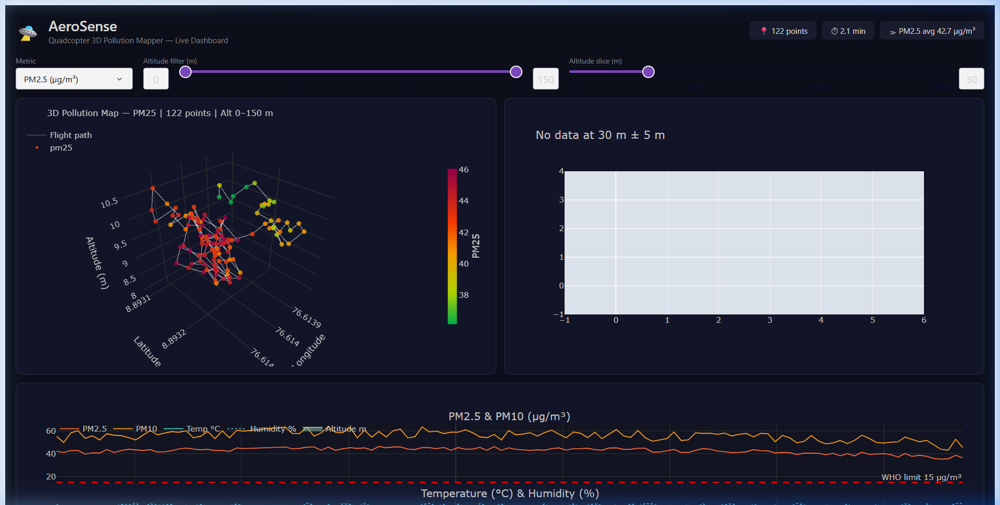

# AeroSense — Execution & Integration Walkthrough

We have successfully launched the dashboard, generated waypoints, and integrated the **Obstacle Avoidance Module** directly inside the drone payload firmware.

---

## 🛡️ Drone Obstacle Avoidance Module

The obstacle avoidance module has been integrated directly into the main drone file [aerosense_main.py](./firmware/aerosense_main.py). 

### 1. New Code Architecture & Drivers
Inside `aerosense_main.py`, we added the following classes and drivers:
*   **`VL53L1XReader`**: Communicates with the I2C Time-of-Flight sensor in long-range mode (measuring up to 4.0 meters) at a 10 Hz rate.
*   **`UltrasonicHCSR04Reader`**: Interacts with low-cost HC-SR04 ultrasonic sensors using Raspberry Pi BCM GPIO pins to trigger sonic pulses and measure echo duration.
*   **`MAVLinkConnection`**: Uses the `pymavlink` library to build a serial connection to the Pixhawk/ArduPilot flight controller and periodically send **`OBSTACLE_DISTANCE` (MAVLink Message #330)** reports.
*   **`avoidance_loop`**: Concurrently polls distance sensors and schedules MAVLink packet transmissions on a separate high-frequency async task (running at 10 Hz) alongside the 1 Hz pollution logging engine.

### 2. Avoidance Configuration settings
Added an `avoidance` configuration section in [config.yaml](./firmware/config.yaml):
```yaml
avoidance:
  enabled: true
  port: /dev/ttyAMA1     # UART telemetry port linked to ArduPilot
  baud: 57600
  safety_distance_m: 2.0  # Safe envelope threshold
  sensors:
    - type: vl53l1x
      i2c_addr: 0x29
      orientation_deg: 0  # Front-facing sensor
    - type: hc_sr04
      trigger_pin: 23
      echo_pin: 22
      orientation_deg: 90 # Right-facing sensor
```

### 3. Simulation & Dry-Run Mode
Since running on developer/Windows workstations lacks the physical GPIO/I2C connections, we implemented an automatic simulation fallback and an explicit CLI command-line flag parser:
*   Running `python firmware/aerosense_main.py --sim` will start the full firmware loop in simulation mode.
*   It generates mock sensor telemetry for SDS011, BME680, ADS1115, GPS coordinate paths, and LoRa transmissions.
*   It runs the obstacle avoidance loop, checking thresholds and printing warning alerts if simulated obstacles fall within the safety threshold.

---

## 📊 AeroSense Live Dashboard

The dashboard server is active in the background and serving live on **http://127.0.0.1:8050/**. It has been configured to read the live simulation database `data/aerosense.db`.

### Dashboard Interface Layout (Rendering Simulation Flight)


*   **3D Flight Path Line**: Traces the volumetric drone trail using coordinates from `data/aerosense.db` colored dynamically by particulate matter levels.
*   **Altitude Slice Grid Heatmap**: Uses SciPy to interpolate spatial concentrations at specific elevation layers.
*   **Stack Time-Series Charts**: Compares PM levels, climate (temp/humidity), and altitude.

---

## 🗺️ Waypoint Mission Planner

The waypoint trajectory grid generator ([aerosense_mission.py](./mission/aerosense_mission.py)) has been fully fixed for Windows console character encodings and outputs waypoints successfully:
*   **Output File**: `aerosense_mission.waypoints`
*   **Survey Bounds**: 200m x 200m grid survey at altitudes of 15m, 30m, and 50m AGL.
